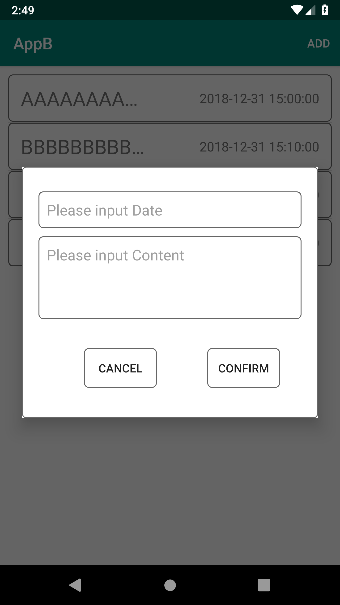
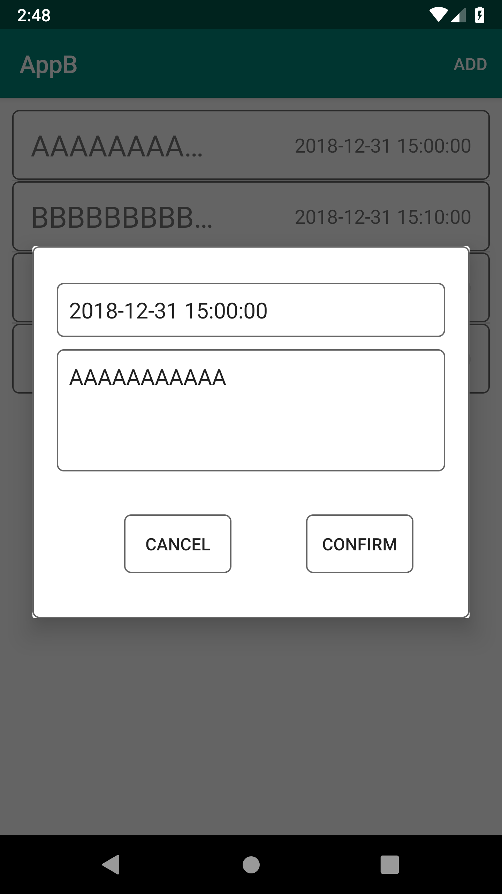
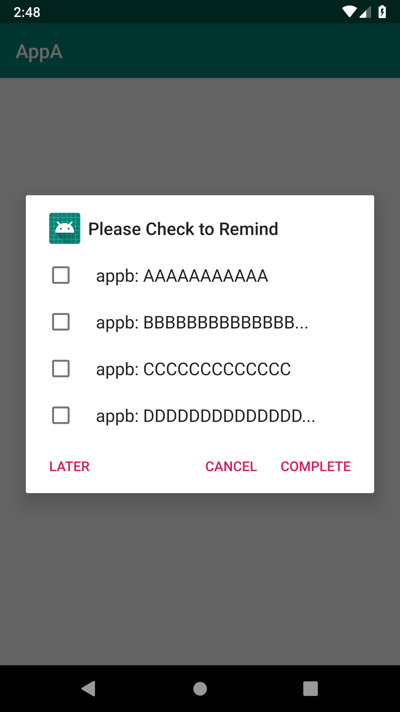

# AIDLSubject
This program is about AIDL for Advanced Topics in IT Architecture class.
## Description
This project contains two modules AppA and AppB, AppA provides add alarm service, and AppB calls the AppA provided service to send information. While AppB edits or deletes the information, the provided service will be called then the AppA while updating the clock information at the same time.
### Environmental configuration
jdk 1.8, sdk 28.

***
## samples

  <h3>These are appb</h3>
  &nbsp;&nbsp;&nbsp;
   
  &nbsp;&nbsp;&nbsp;
  
  <h3>These are appa</h3>
  &nbsp;&nbsp;&nbsp;
   
  &

